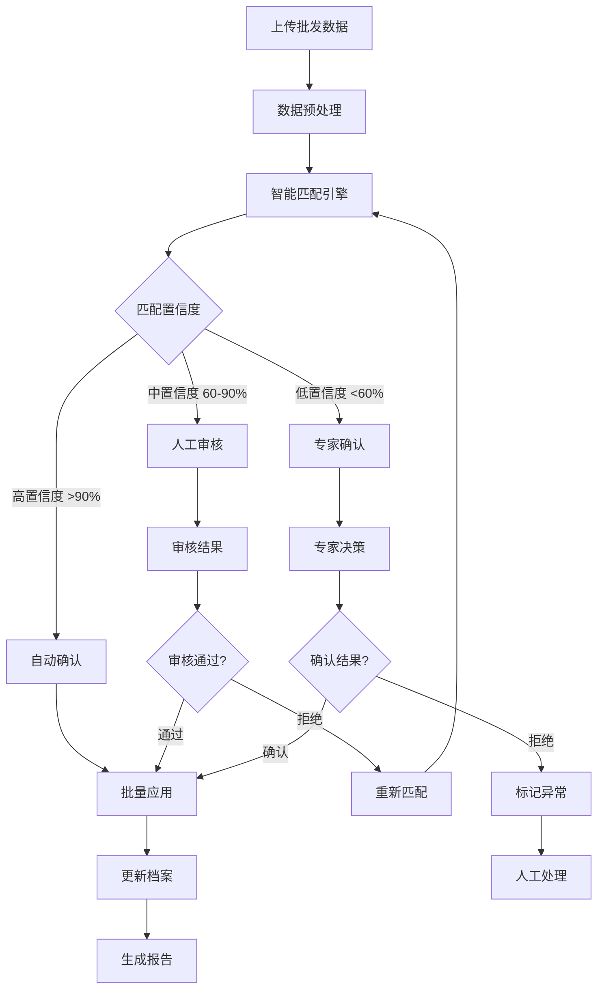

# 智能商品匹配与价格管理系统

## 产品需求文档 (PRD)

**版本**: v1.0  
**日期**: 2024 年  
**项目代号**: SmartMatch

---

## 📋 产品概述

### 业务背景

- 烟草批发商需要将口语化的商品名称匹配到标准商品档案
- 现有 Excel 处理方式存在大量需要人工审核的情况
- 同名不同品的商品需要精确识别和匹配
- 价格信息需要实时更新且可追溯

### 产品价值

- **提升效率**: 将人工匹配时间从小时级降低到分钟级
- **减少错误**: 通过多步骤审核机制确保匹配准确性
- **数据安全**: 完整的操作日志和版本控制
- **决策支持**: 提供匹配统计和趋势分析

---

## 🎯 核心功能

### 1. 商品模板管理系统

- **多模板架构**: 用户可创建多个独立的商品模板（模板A、模板B等）
- **模板隔离**: 每个模板包含独立的商品库，互不影响
- **灵活应用**: 不同业务场景使用不同模板进行匹配
- **模板管理**: 创建、编辑、删除、复制商品模板
- **批量导入**: 向指定模板批量导入商品数据
- **权限控制**: 模板级别的访问权限管理

### 2. 智能匹配引擎

- **模板选择匹配**: 匹配时选择使用哪个商品模板进行匹配
- **多维度算法**: 品牌、关键词、包装类型、价格区间识别
- **可配置阈值**: 每个模板可独立配置匹配阈值
- **学习型优化**: 基于模板历史匹配数据的智能优化
- **跨模板检索**: 可选择在多个模板中同时搜索匹配项

### 3. 多步骤审核流程

- **步骤 1**: 自动匹配 (高置信度直接通过)
- **步骤 2**: 人工审核 (中等置信度)
- **步骤 3**: 专家确认 (低置信度或争议项)
- **步骤 4**: 最终确认和批量应用

### 4. 价格管理

- 实时价格更新
- 价格变动历史
- 价格趋势分析
- 异常价格预警

---

## 🎨 页面设计

### 主要页面架构

```
智能商品匹配系统
├── 🏠 首页/工作台
├── 🗂️ 模板管理
│   ├── 模板创建/编辑
│   ├── 模板列表管理
│   ├── 模板配置中心
│   └── 模板权限管理
├── 📁 商品管理
│   ├── 模板选择器
│   ├── 商品档案管理 (基于选定模板)
│   ├── 批量导入/导出 (指定模板)
│   └── 商品数据同步
├── 🔍 智能匹配
│   ├── 模板选择匹配
│   ├── 匹配任务管理
│   ├── 跨模板搜索
│   └── 匹配规则配置
├── ✅ 审核中心
│   ├── 按模板分组审核
│   ├── 审核工作台
│   └── 审核历史追踪
├── 💰 价格管理
│   ├── 模板价格维护
│   ├── 价格历史追踪
│   └── 跨模板价格分析
└── 📊 统计报表
    ├── 模板匹配效率
    ├── 模板使用统计
    └── 综合分析报告
```

---

## 🔄 业务流程

### 完整工作流程



---

## 📱 详细页面设计

### 1. 🏠 首页/工作台

**布局**: 卡片式仪表板

```
┌─────────────────────────────────────────────────────┐
│ 🏠 智能商品匹配系统                    👤 用户名 ⚙️   │
├─────────────────────────────────────────────────────┤
│ 📊 今日概览                                        │
│ ┌───────┐ ┌───────┐ ┌───────┐ ┌───────┐           │
│ │待处理  │ │已完成  │ │匹配率  │ │异常项  │           │
│ │  128  │ │  892  │ │ 89.2% │ │  15   │           │
│ └───────┘ └───────┘ └───────┘ └───────┘           │
│                                                   │
│ 🔥 快速操作                                        │
│ [📤 上传批发数据] [🔍 开始匹配] [✅ 进入审核]        │
│                                                   │
│ ⏱️ 最近任务                                        │
│ • 批发数据_20240315.xlsx - 匹配中...             │
│ • 批发数据_20240314.xlsx - 审核完成 ✅           │
│ • 批发数据_20240313.xlsx - 已应用 ✅             │
└─────────────────────────────────────────────────────┘
```

**关键要素**:

- 实时数据概览
- 一键操作入口
- 任务状态追踪
- 异常提醒

### 2. 🔍 智能匹配页面

**布局**: 分步骤向导式

```
┌─────────────────────────────────────────────────────┐
│ 🔍 智能匹配向导                                     │
├─────────────────────────────────────────────────────┤
│ 步骤: ①数据上传 → ②匹配配置 → ③执行匹配 → ④结果确认   │
│                                                   │
│ 📁 步骤1: 数据上传                                 │
│ ┌─────────────────────────────────────────────────┐ │
│ │ 📎 拖拽Excel文件到此处                          │ │
│ │    或 [选择文件]                               │ │
│ │                                               │ │
│ │ ✅ 批发数据_20240315.xlsx (238条记录)          │ │
│ │    预览: 中华硬金中支, 盒精品云烟, 印象黄山...   │ │
│ └─────────────────────────────────────────────────┘ │
│                                                   │
│ ⚙️ 步骤2: 匹配配置                                 │
│ • 匹配阈值: [███████░░░] 65分                     │
│ • 自动确认阈值: [██████████] 90分                 │
│ • 匹配策略: ☑️品牌优先 ☑️关键词 ☑️包装类型        │
│                                                   │
│                          [上一步] [开始匹配]      │
└─────────────────────────────────────────────────────┘
```

### 3. ✅ 审核中心 - 核心页面

**布局**: 分栏式对比审核

```
┌─────────────────────────────────────────────────────┐
│ ✅ 审核中心 - 商品匹配审核                 进度: 12/128│
├─────────────────────────────────────────────────────┤
│ 📋 待审核列表 (左侧 30%)    │ 🔍 详细审核区 (右侧 70%) │
│                           │                        │
│ [高优先级] 🔴              │ 🏷️ 当前审核项目         │
│ • 中华硬金中支 → ?          │                        │
│ • 盒精品云烟 → ?            │ 📦 口语化名称           │
│ • 印象黄山 → 黄山(...) 89% │ 中华硬金中支             │
│                           │ 价格: ¥735              │
│ [中优先级] 🟡              │                        │
│ • 大天叶黄金叶 → ?          │ 🎯 系统推荐匹配 (3个候选) │
│ • 方中华(全开) → ?          │                        │
│                           │ ① 中华(硬) 85% ⭐推荐    │
│ [低优先级] 🟢              │ ├ 品牌: 中华 ✅          │
│ • 细支中华 → ?              │ ├ 关键词: 硬 ✅          │
│                           │ ├ 价格区间: 合理 ✅       │
│                           │ └ [选择此项]            │
│                           │                        │
│                           │ ② 中华(硬双中支) 78%     │
│                           │ ├ 品牌: 中华 ✅          │
│                           │ ├ 关键词: 硬双中支 ⚠️    │
│                           │ └ [选择此项]            │
│                           │                        │
│                           │ ③ 中华(硬细支) 72%       │
│                           │ └ [选择此项]            │
│                           │                        │
│                           │ 🆕 [创建新商品]          │
│                           │ ❌ [标记为异常]          │
│                           │                        │
│                           │ 💭 审核备注              │
│                           │ [文本框]                │
│                           │                        │
│                           │ [跳过] [确认选择] [下一个]│
└─────────────────────────────────────────────────────┘
```

**审核页面特色功能**:

- **智能排序**: 按优先级和置信度排序
- **批量操作**: 支持批量确认高置信度项目
- **学习机制**: 记录用户选择偏好
- **协作功能**: 多人审核、备注交流

### 4. 💰 价格管理页面

```
┌─────────────────────────────────────────────────────┐
│ 💰 价格管理中心                                     │
├─────────────────────────────────────────────────────┤
│ 📊 价格概览                   🔍 [搜索商品]        │
│ ┌────────┐ ┌────────┐ ┌────────┐ ┌────────┐      │
│ │今日更新 │ │价格异常 │ │平均涨幅 │ │待确认  │      │
│ │  156   │ │   12   │ │ +2.3%  │ │   8    │      │
│ └────────┘ └────────┘ └────────┘ └────────┘      │
│                                                   │
│ 📋 价格变动列表                                    │
│ ┌─────────────────────────────────────────────────┐ │
│ │商品名称     │旧价格│新价格│变动│时间│操作员│状态 │ │
│ ├─────────────────────────────────────────────────┤ │
│ │中华(硬)     │ 720 │ 735 │+15│12:30│张三│✅  │ │
│ │黄金叶(硬)   │ 715 │ 731 │+16│12:28│李四│⏳  │ │
│ │芙蓉王(硬)   │ 195 │ 201 │ +6│12:25│王五│✅  │ │
│ └─────────────────────────────────────────────────┘ │
│                                                   │
│ 📈 价格趋势图表                                    │
│ [交互式图表区域]                                   │
└─────────────────────────────────────────────────────┘
```

---

## 🔧 技术架构

### 技术栈

- **前端**: React 18 + TypeScript + Ant Design
- **后端**: Node.js + Express + TypeScript
- **数据库**: MongoDB + Redis (缓存)
- **文件处理**: multer + xlsx
- **匹配算法**: 自研 + fuzzy-search
- **部署**: Docker + PM2

### 系统架构图

```
┌─────────────────┐    ┌─────────────────┐    ┌─────────────────┐
│   前端 (React)  │───▶│  API网关         │───▶│  业务服务层      │
│                 │    │  (Express)      │    │                 │
│ • 用户界面      │    │ • 路由管理       │    │ • 匹配引擎       │
│ • 状态管理      │    │ • 身份验证       │    │ • 价格管理       │
│ • 组件库        │    │ • 请求验证       │    │ • 审核流程       │
└─────────────────┘    └─────────────────┘    └─────────────────┘
                                                      │
┌─────────────────┐    ┌─────────────────┐    ┌─────────────────┐
│  文件存储       │    │  缓存层 (Redis) │    │ 数据库(MongoDB) │
│                 │    │                 │    │                 │
│ • Excel文件     │    │ • 会话缓存       │    │ • 商品档案       │
│ • 导出报告      │    │ • 匹配结果       │    │ • 匹配记录       │
│ • 日志文件      │    │ • 用户偏好       │    │ • 操作日志       │
└─────────────────┘    └─────────────────┘    └─────────────────┘
```

---

## 📊 数据模型

### 核心数据结构

```typescript
// 商品模板
interface ProductTemplate {
  _id: ObjectId
  name: string // 模板名称 (如: "模板A", "卷烟模板", "进口烟模板")
  description: string // 模板描述
  category: string // 模板分类
  settings: {
    // 模板配置
    matchingThresholds: {
      autoConfirm: number // 自动确认阈值
      manualReview: number // 人工审核阈值
      expertReview: number // 专家审核阈值
    }
    priceValidation: boolean // 是否启用价格验证
    allowCrossTemplateSearch: boolean // 是否允许跨模板搜索
  }
  createdBy: ObjectId // 创建者
  createdAt: Date
  updatedAt: Date
  isActive: boolean // 是否激活
}

// 商品档案 (关联到模板)
interface ProductArchive {
  _id: ObjectId
  templateId: ObjectId // 所属模板ID
  name: string // 标准商品名
  brand: string // 品牌
  keywords: string[] // 关键词列表
  category: string // 分类
  specifications: {
    // 规格信息
    packageType: string // 包装类型
    size: string // 规格
    price: number // 建议价格
  }
  barcode?: string // 条码
  boxCode?: string // 盒码
  companyPrice?: number // 公司价
  createdAt: Date
  updatedAt: Date
}

// 匹配任务 (关联到模板)
interface MatchingTask {
  _id: ObjectId
  templateId: ObjectId // 使用的模板ID
  templateName: string // 模板名称快照
  filename: string // 源文件名
  status: "processing" | "review" | "completed" | "failed"
  totalItems: number // 总条目数
  processedItems: number // 已处理数
  matches: MatchingRecord[] // 匹配记录
  matchingConfig: {
    // 匹配配置快照
    thresholds: {
      autoConfirm: number
      manualReview: number
      expertReview: number
    }
    crossTemplateSearch: boolean // 是否启用跨模板搜索
  }
  createdBy: ObjectId // 创建者
  createdAt: Date
}

// 匹配记录
interface MatchingRecord {
  _id: ObjectId
  taskId: ObjectId
  wholesaleName: string // 口语化名称
  wholesalePrice: number // 批发价格

  candidates: Array<{
    // 候选匹配项
    productId: ObjectId
    score: number // 匹配分数
    confidence: "high" | "medium" | "low"
    reason: string // 匹配原因
  }>

  selectedMatch?: {
    // 确认的匹配
    productId: ObjectId
    confirmedBy: ObjectId
    confirmedAt: Date
    note?: string
  }

  status: "pending" | "reviewing" | "confirmed" | "rejected" | "exception"
}
```

---

## 🎛️ 核心功能详解

### 1. 智能匹配算法

**多维度评分机制**:

```typescript
interface MatchingScore {
  nameScore: number // 名称相似度 (35%)
  brandScore: number // 品牌匹配度 (25%)
  keywordScore: number // 关键词匹配 (20%)
  packageScore: number // 包装类型 (10%)
  priceScore: number // 价格合理性 (10%)

  totalScore: number // 综合得分
  confidence: "high" | "medium" | "low"
}
```

**自学习优化**:

- 记录用户选择偏好
- 动态调整权重系数
- 品牌特征学习
- 异常模式识别

### 2. 审核工作流

**三级审核机制**:

1. **自动审核** (>90 分): 直接确认
2. **人工审核** (60-90 分): 业务员处理
3. **专家审核** (<60 分): 资深员工确认

**审核界面特性**:

- 智能排序和分组
- 批量操作支持
- 历史选择参考
- 实时协作功能

### 3. 价格管理系统

**价格更新机制**:

- 实时价格同步
- 异常价格检测
- 历史价格追踪
- 批量价格更新

**价格分析功能**:

- 价格趋势图表
- 市场价格对比
- 异常价格预警
- 盈利分析报告

---

## 🚀 实施计划

### 开发阶段

**Phase 1: 基础架构 (2 周)**

- 项目架构搭建
- 数据库设计
- 基础 API 开发
- 用户认证系统

**Phase 2: 核心功能 (3 周)**

- 商品档案管理
- 文件上传处理
- 智能匹配引擎
- 基础审核功能

**Phase 3: 审核系统 (2 周)**

- 多步骤审核流程
- 审核界面优化
- 批量操作功能
- 协作功能

**Phase 4: 价格管理 (1 周)**

- 价格更新功能
- 价格历史追踪
- 价格分析报表
- 异常检测

**Phase 5: 优化完善 (1 周)**

- 性能优化
- 用户体验优化
- 测试和修复
- 部署上线

### 交付物

1. **技术文档**
   - API 接口文档
   - 数据库设计文档
   - 部署指南

2. **用户文档**
   - 用户操作手册
   - 管理员指南
   - 常见问题 FAQ

3. **系统代码**
   - 前端 React 应用
   - 后端 Node.js 服务
   - 数据库脚本
   - Docker 配置

---

## 💡 创新亮点

### 1. 革命性的模板化管理

- **多模板隔离**: 不同业务场景使用独立的商品模板
- **灵活切换**: 随时选择合适的模板进行匹配操作
- **模板复制**: 快速基于现有模板创建新的业务场景
- **权限隔离**: 精确到模板级别的访问控制

### 2. 智能化程度高

- AI 驱动的匹配算法，支持跨模板学习
- 模板级别的自学习优化机制
- 智能异常检测和模板推荐

### 3. 卓越的用户体验

- 直观的模板选择和切换界面
- 基于模板的统一操作流程
- 模板状态的实时反馈和提示

### 4. 超强的业务适应性

- 支持无限扩展的模板数量
- 每个模板独立的匹配规则配置
- 多场景、多品类的完美适配

### 5. 企业级数据安全

- 模板级别的数据隔离和备份
- 完整的操作日志和版本控制
- 基于模板的精细化权限管理

---

## 📈 预期效果

### 效率提升

- **匹配时间**: 从 2-3 小时降至 10-15 分钟
- **准确率**: 从 85%提升至 95%+
- **人工工作量**: 减少 70%

### 成本节约

- **人力成本**: 节约 60%
- **时间成本**: 节约 80%
- **错误成本**: 减少 90%

### 业务价值

- **决策支持**: 实时数据分析
- **风险控制**: 异常检测预警
- **流程标准化**: 规范操作流程

---

## 🔚 总结

本系统将传统的 Excel 处理方式升级为现代化的 Web 应用，通过智能匹配算法和多步骤审核机制，大幅提升商品匹配的效率和准确性。系统设计充分考虑了用户体验和业务需求，具有良好的扩展性和维护性。

**下一步**: 确认需求后开始技术架构设计和原型开发。
